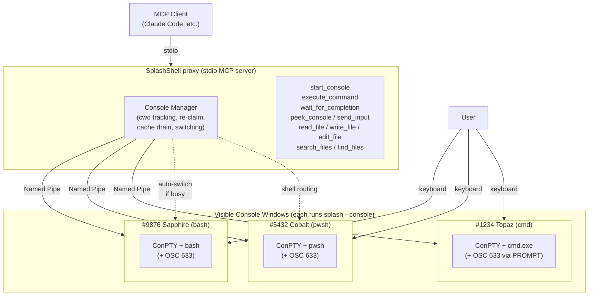

# SplashShell

<div align="center">
  
</div>

**A shell MCP server for AI that actually holds a session.** Load `Import-Module Az` once and let AI run 50 follow-up cmdlets in milliseconds each. Watch every command happen in a real terminal window — the same one you can type into yourself.

## Install

Prerequisite: [.NET 9 Desktop Runtime](https://dotnet.microsoft.com/download/dotnet/9.0). No global install needed — `npx` fetches a ~5 MB native binary on first run.

```bash
claude mcp add-json splash -s user '{"command":"npx","args":["-y","splashshell@latest"]}'
```

<details>
<summary>Claude Desktop</summary>

Add to `%APPDATA%\Claude\claude_desktop_config.json`:

```json
{
  "mcpServers": {
    "splash": {
      "command": "npx",
      "args": ["-y", "splashshell@latest"]
    }
  }
}
```

The `@latest` tag is important: without it, npx will happily keep reusing a stale cached copy even after a new version ships.

</details>

## Why SplashShell?

Other shell MCP servers are either **stateless** (fresh subshell per command, nothing persists) or **headless** (persistent PTY, but invisible to you). SplashShell is neither — and that unlocks things the others can't do.

### PowerShell becomes a first-class AI environment

Session persistence helps every shell, but for **PowerShell it's transformative**. Most MCP shell servers spin up a fresh subshell per command — which makes real PowerShell workflows impractical:

- **10,000+ modules on [PowerShell Gallery](https://www.powershellgallery.com/).** Az (Azure), AWS.Tools, Microsoft.Graph (Entra ID / M365), ExchangeOnlineManagement, PnP.PowerShell, SqlServer, ActiveDirectory — plus every CLI in PATH (git, docker, kubectl, terraform, gh, az, aws, gcloud) and full access to .NET types.
- **30–70 second cold imports, paid once.** `Import-Module Az.Compute, Az.Storage, Az.Network` can take over a minute on the first call. A subshell-per-command MCP server pays that cost on *every* command and the AI gives up on Azure workflows entirely. With SplashShell, the AI imports once and every subsequent cmdlet runs in milliseconds.
- **Live .NET object graphs.** PowerShell pipes rich objects, not text. After `$vms = Get-AzVM -Status`, the AI can chain arbitrary follow-ups against the live object — filter, group, drill into nested properties — without re-hitting Azure. In a one-shot MCP server, that object vanishes the moment the command returns.
- **Interactive build-up of complex work.** Set a variable, inspect it, reshape it, feed it back into the next cmdlet. Build a multi-step workflow one command at a time with every previous step's result still in scope.

```powershell
# Command 1 — cold import, paid once for the whole session
Import-Module Az.Compute, Az.Storage, Az.Network

# Command 2 — instant; capture the result into a variable
$vms = Get-AzVM -Status

# Command 3 — instant; same session, $vms still in scope
$vms | Where-Object PowerState -eq "VM running" |
    Group-Object Location | Sort-Object Count -Descending

# Command 4 — instant; reach into a new service, same session
Get-AzStorageAccount | Where-Object { -not $_.EnableHttpsTrafficOnly }
```

PowerShell on SplashShell is the difference between **"AI can answer one-off questions"** and **"AI can do real infrastructure work."** bash and cmd are fully supported too, but pwsh is where SplashShell shines.

### Full transparency, in both directions

SplashShell opens a **real, visible terminal window**. You see every AI command as it runs — same characters, same output, same prompt — and you can type into the same window yourself at any time. When a command hangs on an interactive prompt, stalls in watch mode, or just needs a Ctrl+C, the AI can read what's currently on the screen and send keystrokes (Enter, y/n, arrow keys, Ctrl+C) back to the running command — diagnosing and responding without human intervention.

## Tools

### Shell tools

| Tool | Description |
|------|-------------|
| `start_console` | Open a visible terminal window. Pick a shell (bash, pwsh, powershell, cmd, or a full path). Optional `cwd`, `banner`, and `reason` parameters. Reuses an existing standby of the same shell unless `reason` is provided. |
| `execute_command` | Run a pipeline. Optionally specify `shell` to target a specific shell type — finds an existing console of that shell, or auto-starts one. Times out cleanly with output cached for `wait_for_completion`. On timeout, includes a `partialOutput` snapshot so the AI can diagnose stuck commands immediately. |
| `wait_for_completion` | Block until busy consoles finish and retrieve cached output (use after a command times out). |
| `peek_console` | Read-only snapshot of what a console is currently displaying. On Windows, reads the console screen buffer directly (exact match with the visible terminal). On Linux/macOS, uses a built-in VT terminal interpreter as fallback. Specify a console by display name or PID, or omit to peek at the active console. Reports busy/idle state, running command, and elapsed time. |
| `send_input` | Send raw keystrokes to a **busy** console's PTY input. Use `\r` for Enter, `\x03` for Ctrl+C, `\x1b[A` for arrow up, etc. Rejected when the console is idle (use `execute_command` instead). Console must be specified explicitly — no implicit routing, for safety. Max 256 chars per call. |

Status lines include the console name, shell family, exit code, duration, and current directory:

```
✓ #12345 Sapphire (bash) | Status: Completed | Pipeline: ls /tmp | Duration: 0.6s | Location: /tmp
```

### File tools

Claude Code–compatible file primitives (`read_file`, `write_file`, `edit_file`, `search_files`, `find_files`), useful when the MCP client doesn't already provide them.

## Multi-shell behavior

Each console tracks its own cwd. When the active console is busy, the AI is auto-routed to a sibling console of the same shell family — started at the source console's cwd — and its next command runs immediately. Manual `cd` in the terminal is detected and the AI is warned before it runs the wrong command in the wrong place.

Other niceties: **console re-claim** — consoles outlive their parent MCP process, so AI client restarts don't kill your loaded modules and variables. **Multi-line PowerShell** — heredocs, foreach, try/catch, and nested scriptblocks all work. **Sub-agent isolation** — parallel AI agents each get their own consoles so they don't clobber each other's shells.

<details>
<summary>Full routing matrix</summary>

| Scenario | Behavior |
|---|---|
| First execute on a new shell | Auto-starts a console; warns so you can verify cwd before re-executing |
| Active console matches requested shell | Runs immediately |
| Active console busy, same shell requested | Auto-starts a sibling console **at the source console's cwd** and runs immediately |
| Switch to a same-shell standby | Prepends `cd` preamble so the command runs in the source cwd, then executes |
| Switch to a different shell | Warns to confirm cwd (cross-shell path translation is not implemented) |
| User manually `cd`'d in the active console | Warns so the AI can verify the new cwd before running its next command |

</details>

## How it works

SplashShell runs as a stdio MCP server. When the AI calls `start_console`, SplashShell spawns itself in `--console` mode as a ConPTY worker, which hosts the actual shell (cmd.exe, pwsh.exe, bash.exe) inside a real Windows console window. The parent process streams stdin/stdout over a named pipe, injects [OSC 633 shell integration](https://code.visualstudio.com/docs/terminal/shell-integration) scripts (the same protocol VS Code uses) to emit explicit command-lifecycle markers, and parses those markers to delimit command output, track cwd, and capture exit codes — no output-silence heuristics, no prompt-string detection.

<details>
<summary>Architecture diagram</summary>



</details>

### Build from source

```bash
git clone https://github.com/yotsuda/splashshell.git
cd splashshell
dotnet publish -c Release -r win-x64 --no-self-contained -o ./dist
```

The binary is `./dist/splash.exe`. Use the absolute path instead of the `npx` command in your MCP config.

## Platform support

**Windows** is the primary target (ConPTY + Named Pipe, fully tested). Unix PTY fallback for Linux/macOS is experimental.

## Known limitations

- **cmd.exe exit codes always read as 0** — cmd's `PROMPT` can't expand `%ERRORLEVEL%` at display time, so AI commands show as `Finished (exit code unavailable)`. Use `pwsh` or `bash` for exit-code-aware work.
- **Don't `Remove-Module PSReadLine -Force` inside a pwsh session** — PSReadLine's background reader threads survive module unload and steal console input, hanging the next AI command. Not recoverable.

## License

MIT. Release notes in [CHANGELOG.md](CHANGELOG.md).
